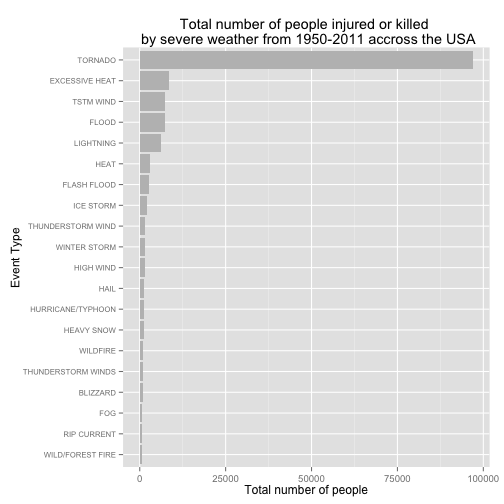
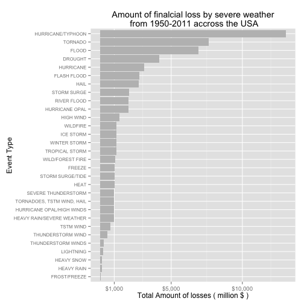

Storm Events and its Economic Conseqences from 1950-2011 across the United States
========================================================
Storms and other severe weather events can cause both public health and economic problems for communities and municipalities. Many severe events can result in fatalities, injuries, and property damage, and preventing such outcomes to the extent possible is a key concern.

This project involves exploring the U.S. National Oceanic and Atmospheric Administration's (NOAA) storm database. This database tracks characteristics of major storms and weather events in the United States, including when and where they occur, as well as estimates of any fatalities, injuries, and property damage.

_Written by Yonghee Lee ( 2014.06.18 )_

## Data Processing

```r
stormData <- read.csv("./data/repdata-data-StormData.csv.bz2")


library(plyr)
stormData$harmOfHealth <- stormData$FATALITIES + stormData$INJURIES
summary(stormData$harmOfHealth)
```

```
##    Min. 1st Qu.  Median    Mean 3rd Qu.    Max. 
##     0.0     0.0     0.0     0.2     0.0  1740.0
```

```r
harmOfHealthByEvtype <- ddply(subset(stormData, harmOfHealth > 0), .(EVTYPE), summarise, total.harmOfHealth = sum(harmOfHealth))
resultOfHarmHealth <- harmOfHealthByEvtype[order(-harmOfHealthByEvtype$total.harmOfHealth),][1:20,]
resultOfHarmHealth <- transform(resultOfHarmHealth, EVTYPE = reorder(EVTYPE, total.harmOfHealth))
summary(resultOfHarmHealth)
```

```
##                 EVTYPE   total.harmOfHealth
##  WILD/FOREST FIRE  : 1   Min.   :  557     
##  RIP CURRENT       : 1   1st Qu.:  982     
##  FOG               : 1   Median : 1456     
##  BLIZZARD          : 1   Mean   : 7362     
##  THUNDERSTORM WINDS: 1   3rd Qu.: 3789     
##  WILDFIRE          : 1   Max.   :96979     
##  (Other)           :14
```

```r
exponentCodeMap <- list('0'='',
                        '1'=c('-', '?', '+'),
                        '10'=c(1),
                        '100'=c(2,'h','H'),
                        '1000'=c(3,'k','K'),
                        '10000'=c(4),
                        '100000'=c(5),
                        '1000000'=c(6,'m','M'),
                        '10000000'=c(7),
                        '100000000'=c(8),
                        '1000000000'=c(9,'b','B'))


levels(stormData$PROPDMGEXP) <- exponentCodeMap
stormData$proDmgExp.fix <- as.numeric(levels(stormData$PROPDMGEXP))[stormData$PROPDMGEXP]

levels(stormData$CROPDMGEXP) <- exponentCodeMap
stormData$cropDmgExp.fix <- as.numeric(levels(stormData$CROPDMGEXP))[stormData$CROPDMGEXP]

stormData$dmgOfEncomic <- stormData$proDmgExp.fix+ stormData$cropDmgExp.fix
dmgOfEconomic.data <- ddply(subset(stormData, dmgOfEncomic >0), .(EVTYPE), summarise, total.dmgEco = sum(dmgOfEncomic))
resultOfDmgOfEco<- dmgOfEconomic.data[order(-dmgOfEconomic.data$total.dmgEco),][1:30,]                                
resultOfDmgOfEco <- transform(resultOfDmgOfEco, EVTYPE = reorder(EVTYPE,total.dmgEco))
```

## Results


```r
library(ggplot2)
ggplot(resultOfHarmHealth)+ geom_bar(aes(x=EVTYPE,y=total.harmOfHealth), stat="identity", fill="gray") +
    labs(list(title="Total number of people injured or killed \n by severe weather from 1950-2011 accross the USA" , x="Event Type", y="Total number of people" )) +
    coord_flip() +  theme(axis.text.y=element_text(size=rel(0.8)))
```

 

You can also embed plots, for example:


```r
library(scales)
ggplot(resultOfDmgOfEco)+ geom_bar(aes(x=EVTYPE,y=total.dmgEco/10^6), stat="identity", fill="gray") +
    labs(list(title="Amount of finalcial loss by severe weather\n from 1950-2011 accross the USA" , x="Event Type", y="Total Amount of losses ( million $ )" )) +
    scale_y_continuous(labels=dollar,breaks=c(1000,5000,10000)) +
    coord_flip() +  theme(axis.text.y=element_text(size=rel(0.8)))
```

 

